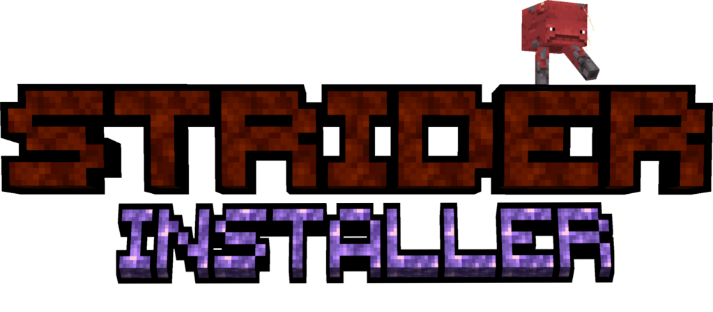

  
   
  

**StriderInstaller** is the simple, lightweight and easy official installer for [StriderLoader](https://github.com/nozyx12/striderloader).

### ⚠️ Java 17 or higher is needed to run the installer ⚠️

## Features

* **Everything is automatic** — install StriderLoader with an ultra-simple and easy-to-use interface.
* Install **StriderLoader for the Minecraft client** directly into the Minecraft Launcher.
* Install **StriderLoader for Minecraft servers**, with the option to disable the StriderLoader startup UI.
* Fully set up a Minecraft server automatically, including all required Minecraft and StriderLoader files.
* Automatically generate ready-to-use launch scripts for **Windows (`.bat`)** and **Linux/macOS (`.sh`)**.

## How it works

### Client

When installing StriderLoader for the Minecraft client, StriderInstaller:

1. Creates a dedicated Minecraft version configuration specifically configured for StriderLoader.
2. Configures the version with the required StriderLoader files and launch arguments.
3. Automatically adds a dedicated **Game Profile** to the Minecraft Launcher.
4. The new profile can then be launched directly from the official Minecraft Launcher.

### Server

For server installations, StriderInstaller handles the entire setup automatically:

1. Downloads the official Minecraft server bundle for the selected version.
2. Extracts all bundled Minecraft libraries into the server's `libraries` directory.
3. Extracts the non-bundled Minecraft server JAR.
4. Downloads StriderLoader and all of its required libraries.
5. Optionally configures the server to disable the StriderLoader startup UI.
6. Generates ready-to-use launch scripts for **Windows (`run.bat`)** and **Linux/macOS (`run.sh`)**.

No manual dependency setup or configuration is required.

## Download

You can download StriderInstaller from [my Maven repository](https://maven.nozyx.dev/dev/nozyx/strider/striderinstaller/).

## License

**GNU General Public License v3.0 only** — see the [LICENSE file](./LICENSE).
